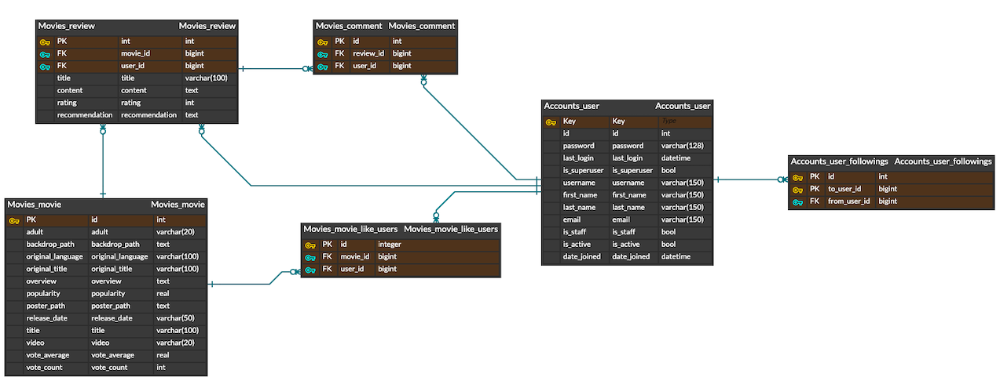

# CEMO

### 기간 : 2023.05.16 - 2023.05.26
### Update : 2023.05.30 - 2023.06.16

 

1. 팀원 정보 및 업무 분담 내역
    - 변민지
        - 팀장
        - 프론트엔드 담당
            - Vue 코드 설계
            - CSS 코드 설계
            - 전체 페이지 기능 구축
        - 발표
            - 페이지 기능 시연
            - 질의 응답
    - 이동현
        - 팀원
        - 백엔드 담당
            - DRF 코드 설계
            - DB 모델링
        - 페이지 디자인 프로토타이핑
        - 발표
            - PPT 자료 만들기
            - 프레젠테이션
            - 질의 응답
2. 개발 환경
    - Python 3.9
    - Django 3.2
    - Node.js 18.0
    - Vue 2
3. 사용 아키텍처
    - Django REST Framework & Vue 

4. 목표 서비스 구현 및 실제 구현 정도
    - 게시글 : 완성
    - 댓글 : 완성
    - 좋아요 : 완성
    - 팔로우 : 완성
    - 영화 추천 : 완성
5. 데이터베이스 모델링 ( ERD )
    
    
    
6. 영화 추천 알고리즘에 대한 기술적 설명
    - TMDB 사이트에서 특정 영화와 비슷한 영화를 추천해주는 similar API 를 불러와서 특정 영화 상세 페이지에 접속하면 연관된 영화를 추천할 수 있도록 설계했습니다.
    - 해당 similar API 는 기존에 불러왔던 movie API 와 달리 movie_id 값을 URL에 추가하여 상세 페이지의 movie_id 와 매칭이 되는 영화를 불러올 수 있도록 코드를 구성했습니다.
7. 서비스 대표 기능에 대한 설명
    - 기본 커뮤니티 기능 구현하기
        - 게시글 : MovieDetail 페이지에서 특정 영화에 대한 게시글 작성이 가능하며, 작성시 게시글에 대한 추가 댓글을 작성할 수 있도록 설계.
        - 댓글 : 상단에 명시한 게시글 기능에서 추가로 댓글을 작성하면 작성된 게시글이 저장되어 새로고침 되어도 그대로 유지되도록 설계.
        - 좋아요 : Movie 모델에 추가된 like_users 필즈를 참조하여 좋아요 기능 설계. 기존의 목록에 exist()가 참인 경우는 목록에서 삭제하고, 반대의 경우는 해당 user 를  목록에 add() 하도록 구현.
        - 팔로우 : User 모델에 followings 필즈를 다대다 관계로 설정하여 추가, 좋아요 기능과 마찬가지로 내가 특정 유저를 팔로우를 했을때 이미 목록에 있을 때에는 is_followed = False , 반대의 경우는 True 로 설정.
    - 영화 추천 알고리즘
        - TMDB 사이트에서 비슷한 영화를 추천해주는 API 인 similar API 를 불러와서 특정 영화 페이지에 접속시 추천 영화가 보여지도록 구성.
8. 배포 서버 URL ( 배포했을 경우 )
9. 기타 (느낀점, 후기 등)
    - 변민지
      - 모델 설계부터 화면 구현까지 웹 페이지를 만드는 일련의 과정들을 배울 수 있었습니다.
      - 모델과 DB 부분이 핵심임을 알았습니다. 초기에 DB를 잘 설계하는 것이 불필요한 작업을 줄일 수 있음을 배웠습니다.
      - 나무를 보는 것보다 숲을 보는 것이 중요함을 느꼈습니다. 코드를 작성하다 보면 이걸 왜 하고 있지? 라는 생각이 들 때가 있었고, 본래의 목적을 잊어버리는 경우도 종종 있었습니다. 코드의 목적을 명확히 인지하고 주의하면서 코드를 작성해야겠다고 느꼈습니다.
      - 프로젝트를 하면서 지금까지 배웠던 것들을 정리할 수 있었습니다. 나아가 수업시간에 배웠던 것들을 넘어서 더 많은 것들을 배웠습니다. 앞으로 다양한 프로젝트를 경험하는 것이 중요할 것 같습니다.
      - 처음에는 오래 걸렸던 일이 손에 익으면서 속도가 빨라짐을 느꼈습니다. 무리없이 코드를 작성하는 모습을 보고 성장하고 있구나 라고 느꼈습니다.
    - 이동현
        - 일상 속에서 이용하는 웹사이트들에서 정말 흔하게 볼 수 있었던 기능이나 특징들이 결코 사소하지 않은 것이라는 생각이 들었습니다.
        - 기획하는 것을 코드로 옮기는 것이 생각보다 어렵다는 점을 다시 자각하게 되었습니다.
        - 코드를 쓸 때마다 발생하는 에러를 해결하는 것이 정말 어려웠습니다. 촘촘히 얽혀있는 코드 특성상 한 부분을 고쳐서 디버깅하면 다른 부분에서 또 다른 에러가 발생하기 일쑤였는데, 한줄씩 print 혹은 console.log 를 통해 어디까지 코드가 통과되는지 확인하는 과정을 통해 상당부분을 해결할 수 있었습니다.
        - 명세가 없는 기존의 관통프로젝트와 달리 기획부터 구현까지 정해지지 않은 과제를 마무리 하기까지 혼자였다면 절대 못 했을텐데, 유능한 팀원의 도움으로 프로젝트를 잘 마무리 할 수 있었습니다.
        - 부족한 팀원의 역량까지 열심히 채워가는 페어를 보며 추후 다른 프로젝트를 할 때 이렇게 해야겠구나 하고 많이 배웠던 시간이었습니다.
